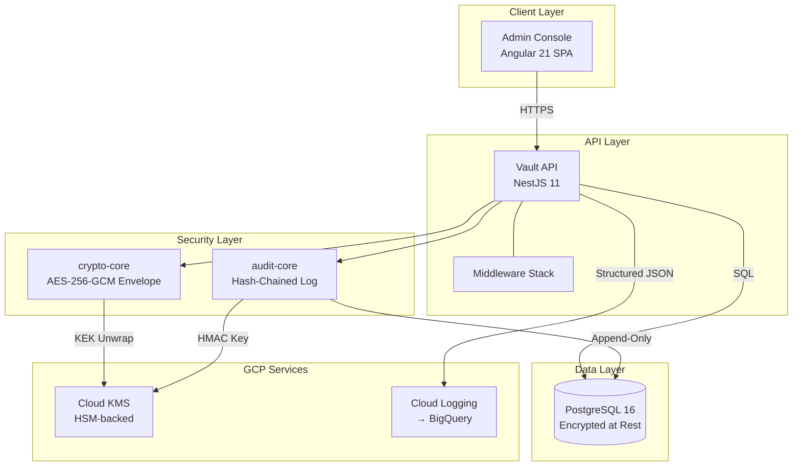
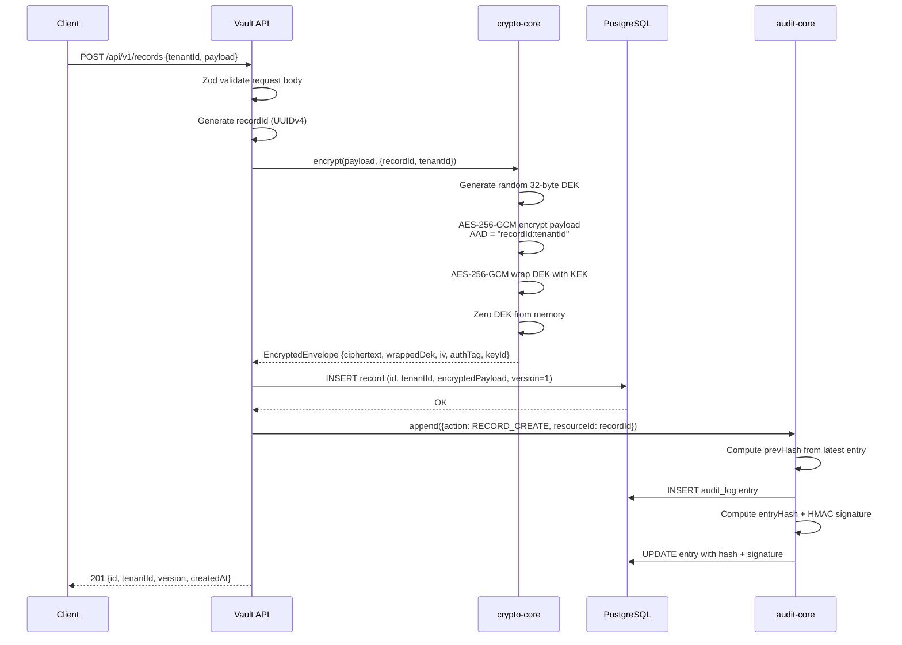

# Architecture Overview

## System Diagram



## Middleware Stack (request order)

```
1. CorrelationMiddleware     → Assigns X-Request-ID via AsyncLocalStorage
2. ThrottlerGuard            → Rate limiting (100 req/60s global, 20/60s records)
3. LoggingInterceptor        → Structured request/response logging (PII-redacted)
4. ZodValidationInterceptor  → Validates @ZodBody, @ZodQuery, @ZodParam schemas
5. Controller Handler        → Business logic
6. AuditInterceptor          → Appends hash-chained audit entry (POST/PUT/PATCH/DELETE)
7. ZodResponseInterceptor    → Validates outbound response shape
8. HttpExceptionFilter       → RFC 7807 error formatting
```

## Data Flow: Create Encrypted Record



## Package Dependency Graph

```
packages/shared-types     (zero internal deps, zero runtime deps)
packages/crypto-core      (zero internal deps, zero runtime deps)
packages/audit-core       (zero internal deps, zero runtime deps)
     │           │              │
     └───────────┼──────────────┘
                 ▼
         apps/vault-api    (depends on all three packages)

         apps/admin-console (depends on shared-types only)
```

All three packages use only Node.js built-in modules (`crypto`). This is intentional — they can be extracted and reused in any Node.js project without NestJS.

## Database Schema

| Table       | Key Columns                                       | Notes                     |
| ----------- | ------------------------------------------------- | ------------------------- |
| `tenants`   | id, name, created_at                              | Logical data isolation    |
| `users`     | id, tenant_id (FK), email, role, created_at       | Per-tenant users          |
| `records`   | id, tenant_id (FK), encrypted_payload, version    | Envelope-encrypted JSONB  |
| `audit_log` | sequence (bigserial), prev_hash, entry_hash, hmac | Append-only, hash-chained |
